# Parametric CAD Kernel

An open-source parametric CAD system written in Rust, targeting browser deployment via WebAssembly.

## Rendered Output

Generated by tessellating B-Rep solids and projecting to SVG with painter's algorithm shading.

### Basic Primitives

<table>
<tr>
<td>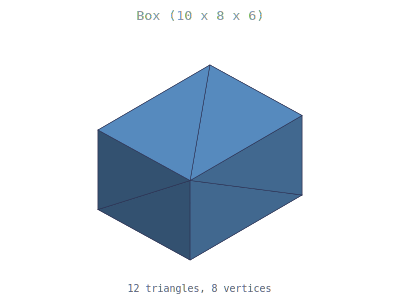</td>
<td>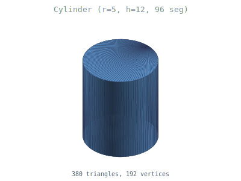</td>
</tr>
<tr>
<td>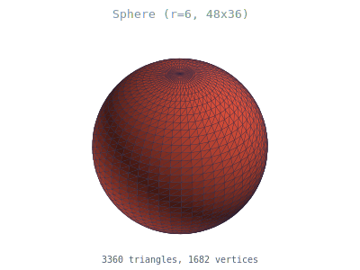</td>
<td>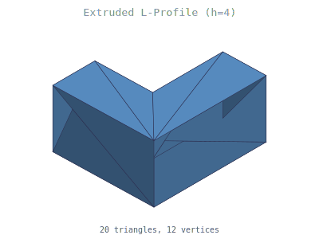</td>
</tr>
<tr>
<td>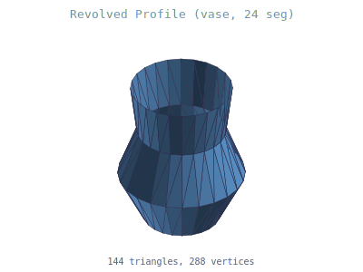</td>
<td>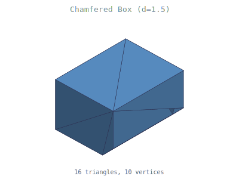</td>
</tr>
<tr>
<td>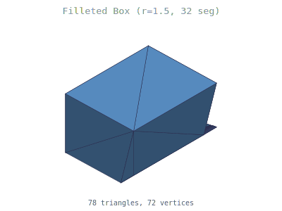</td>
<td>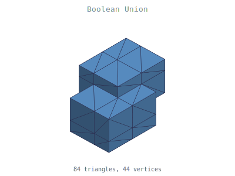</td>
</tr>
</table>

### Advanced Feature Tree Examples

High-resolution models built using the parametric feature tree with constraint solving, multi-step operations, and boolean combinations.

<table>
<tr>
<td>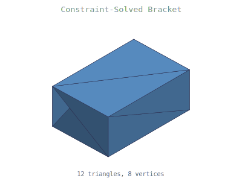</td>
<td>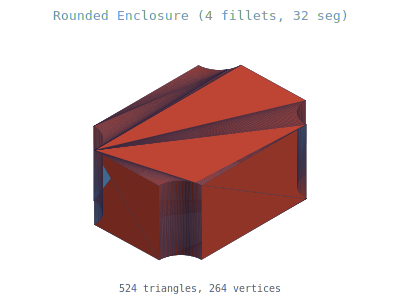</td>
</tr>
<tr>
<td>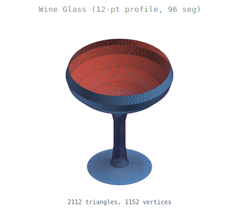</td>
<td>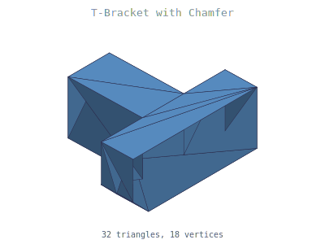</td>
</tr>
<tr>
<td>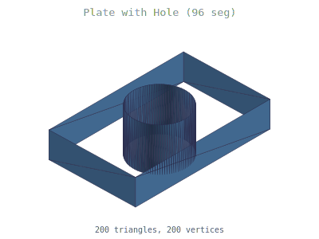</td>
<td>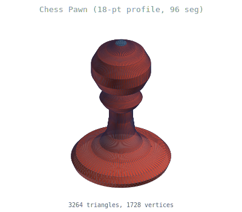</td>
</tr>
<tr>
<td>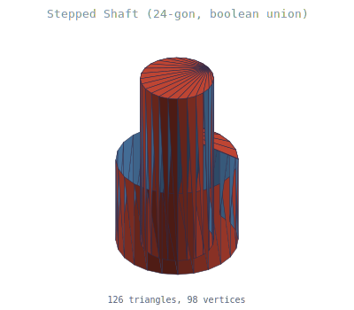</td>
<td></td>
</tr>
</table>

To regenerate: `cargo run -p cad-render`

## Architecture

```
crates/
  kernel/        - B-Rep topology, geometry, Boolean ops, operations
  tessellation/  - Triangle mesh generation, OBJ/STL export
  solver/        - 2D constraint solver (Gauss-Newton + Levenberg-Marquardt)
  wasm-bridge/   - WebAssembly API wrapping the kernel
  render/        - SVG render and mesh export generation (dev tool)
```

## Key Features

**Geometry Engine**
- Points, vectors, transforms, bounding boxes
- Curves: lines, circles, ellipses, NURBS
- Surfaces: planes, cylinders, cones, spheres, tori, NURBS
- Ray intersection: plane, sphere, cylinder, cone, torus, AABB, line-line
- Surface-surface intersection: plane-plane, plane-cylinder, plane-sphere

**B-Rep Topology**
- Half-edge data structure with SlotMap arena allocation
- Euler-Poincare validation (V - E + F = 2)
- Topology auditing (closed loops, twin consistency, dangling vertices, normal consistency)
- Full geometry verification (edge parameterization, surface containment, tolerance-based)
- Structured tracing instrumentation on key operations

**Hierarchical BRepValidator**
- Level 0-1: Topology (Euler-Poincare, twin consistency, loop closure, vertex-on-curve)
- Level 2: Geometric consistency (SameParameter edge-surface check, degenerate edge/face detection)
- Level 3: Spatial coherence (free edges, non-manifold edges, self-intersection via sweep-and-prune)
- Level 5: Continuity (G0 positional, G1 tangent measurement across shared edges)
- Structured `ValidationReport` with error codes, numeric values, and tolerance thresholds
- Operation test harness with pre/post validation and volume delta tracking

**Solid Operations**
- Primitives: box, cylinder, sphere (configurable segment counts)
- Extrude: arbitrary 2D profiles along a direction
- Revolve: profiles around an arbitrary axis with configurable segments
- Fillet: smooth rounded edges with configurable segment count (slerp interpolation)
- Chamfer: edge beveling on box primitives
- Boolean: union, intersection, difference (AABB grid decomposition + face splitting for Tier 2)
- All operations return `Result` with structured error types (`OperationError`)

**Parametric Feature Tree**
- Sketch, Extrude, Revolve, Fillet, Chamfer, Boolean features
- Named parameters with tree-level override resolution
- Constraint solver integration for sketch profiles
- Edge selection via position-based deduplication
- Full re-evaluation on parameter changes with error reporting

**Constraint Solver**
- 13 constraint types: coincident, distance, angle, parallel, perpendicular, horizontal, vertical, tangent, symmetric, equal, radius, fixed, point-on-entity
- Gauss-Newton with Levenberg-Marquardt damping
- Analytic Jacobians for quadratic convergence
- Degrees-of-freedom tracking via SVD-based Jacobian rank analysis
- Over-constrained and under-constrained detection with diagnostics

**Tessellation & Export**
- Ear-clipping triangulation for planar faces (handles concave polygons)
- UV grid sampling for parametric surfaces
- Vertex welding (quantize-based spatial hashing) for watertight meshes
- Winding repair (BFS propagation + signed volume orientation)
- Mesh validation: boundary edges, non-manifold edges, Euler characteristic, signed volume
- OBJ and binary STL export
- f32 output for WebGL compatibility

## Building

```bash
cargo build --workspace
cargo test --workspace       # 403 tests
cargo run -p cad-render      # generate SVG renders + OBJ/STL exports (~50s)
```

Exported mesh files are written to `docs/exports/` (OBJ, STL).

## Tests

403 tests across 5 crates:
- **228** kernel (topology, geometry, boolean, surface intersection, face splitting, operations, validation, traits)
- **32** property-based (proptest: random AABB booleans, transforms, vectors, primitives, volume identity)
- **60** solver (13 constraint types, DOF tracking, over/under-constrained detection, edge cases)
- **51** tessellation (ear-clipping, mesh quality, feature tree validation, OBJ/STL export)
- **32** wasm-bridge (primitives, features, constraints, boolean, DOF, solver warnings, export)
