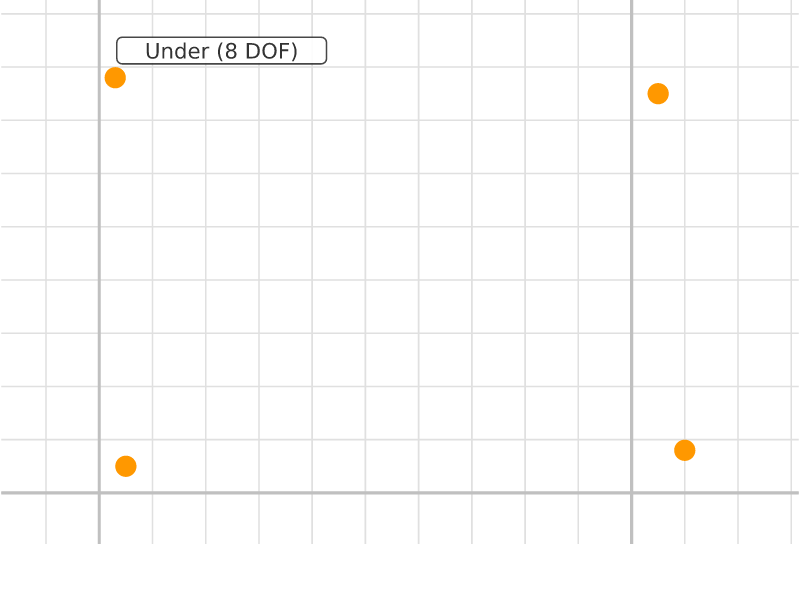
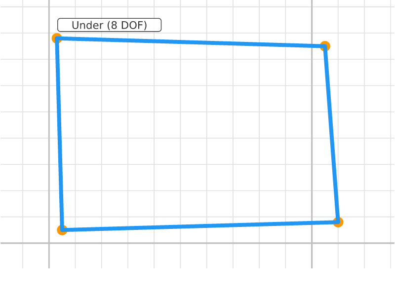
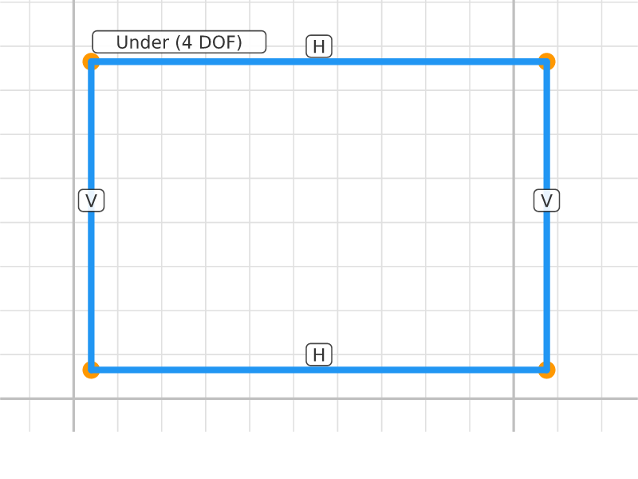
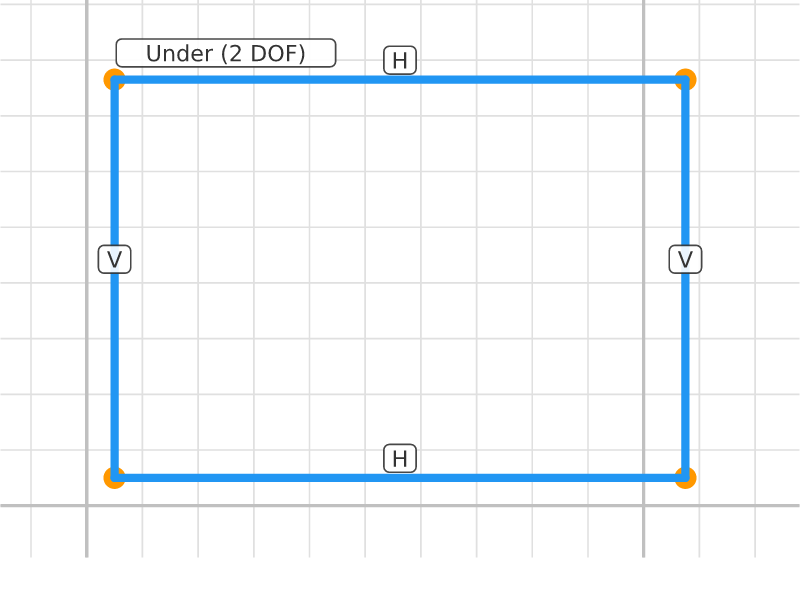
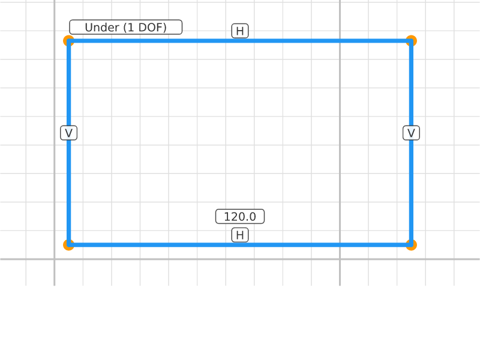
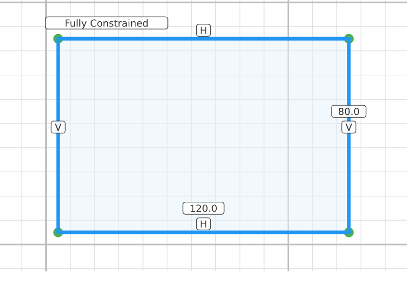

# Parametric Rectangle

## Step 0: Four Points
**Status**: Under-constrained (8 DOF) | **Entities**: 4 pt | **Constraints**: 0
> Four corner points placed at rough positions. No constraints — all points free to move.

| Point | X | Y |
|-------|-------|-------|
| P1 | 5.00 | 5.00 |
| P2 | 110.00 | 8.00 |
| P3 | 105.00 | 75.00 |
| P4 | 3.00 | 78.00 |

---

## Step 1: Connected
**Status**: Under-constrained (8 DOF) | **Entities**: 4 pt, 4 ln | **Constraints**: 0
> Lines connect corners into a closed loop. DOF unchanged — lines reference existing points, adding no new parameters.

| Point | X | Y |
|-------|-------|-------|
| P1 | 5.00 | 5.00 |
| P2 | 110.00 | 8.00 |
| P3 | 105.00 | 75.00 |
| P4 | 3.00 | 78.00 |

**Profiles detected**: 2 closed profile(s)

---

## Step 2: Hv Constrained
**Status**: Under-constrained (4 DOF) | **Entities**: 4 pt, 4 ln | **Constraints**: 4
> Top/bottom horizontal, left/right vertical. Rectangle now axis-aligned but size and position still free.

**Active constraints**:
- Horizontal(E10)
- Horizontal(E12)
- Vertical(E11)
- Vertical(E13)

| Point | X | Y |
|-------|-------|-------|
| P1 | 4.00 | 6.50 |
| P2 | 107.50 | 6.50 |
| P3 | 107.50 | 76.50 |
| P4 | 4.00 | 76.50 |

**Profiles detected**: 2 closed profile(s)

---

## Step 3: Pinned
**Status**: Under-constrained (2 DOF) | **Entities**: 4 pt, 4 ln | **Constraints**: 5
> Bottom-left corner pinned at origin. Position fixed, but width and height still free.

**Active constraints**:
- Horizontal(E10)
- Horizontal(E12)
- Vertical(E11)
- Vertical(E13)
- Dragged(P1)

| Point | X | Y |
|-------|-------|-------|
| P1 | 5.00 | 5.00 |
| P2 | 107.50 | 5.00 |
| P3 | 107.50 | 76.50 |
| P4 | 5.00 | 76.50 |

**Profiles detected**: 2 closed profile(s)

---

## Step 4: Width Set
**Status**: Under-constrained (1 DOF) | **Entities**: 4 pt, 4 ln | **Constraints**: 6
> Width constrained to 120mm. Only height remains free.

**Active constraints**:
- Horizontal(E10)
- Horizontal(E12)
- Vertical(E11)
- Vertical(E13)
- Dragged(P1)
- Distance(E1, E2, 120.0mm)

| Point | X | Y |
|-------|-------|-------|
| P1 | 5.00 | 5.00 |
| P2 | 125.00 | 5.00 |
| P3 | 125.00 | 76.50 |
| P4 | 5.00 | 76.50 |

**Profiles detected**: 2 closed profile(s)

---

## Step 5: Fully Constrained
**Status**: Fully constrained (0 DOF) | **Entities**: 4 pt, 4 ln | **Constraints**: 7
> Height constrained to 80mm. Fully constrained — zero DOF, rectangle is 120×80mm at origin.

**Active constraints**:
- Horizontal(E10)
- Horizontal(E12)
- Vertical(E11)
- Vertical(E13)
- Dragged(P1)
- Distance(E1, E2, 120.0mm)
- Distance(E2, E3, 80.0mm)

| Point | X | Y |
|-------|-------|-------|
| P1 | 5.00 | 5.00 |
| P2 | 125.00 | 5.00 |
| P3 | 125.00 | 85.00 |
| P4 | 5.00 | 85.00 |

**Profiles detected**: 1 closed profile(s)

---
