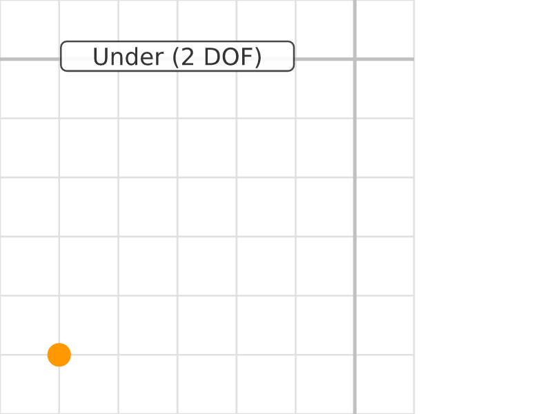
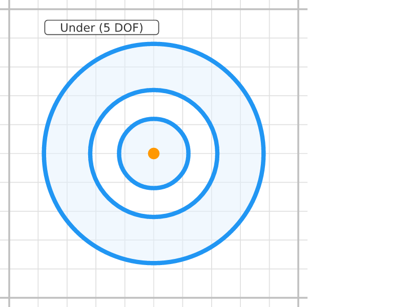
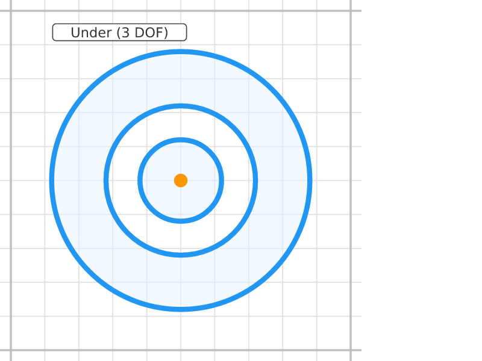
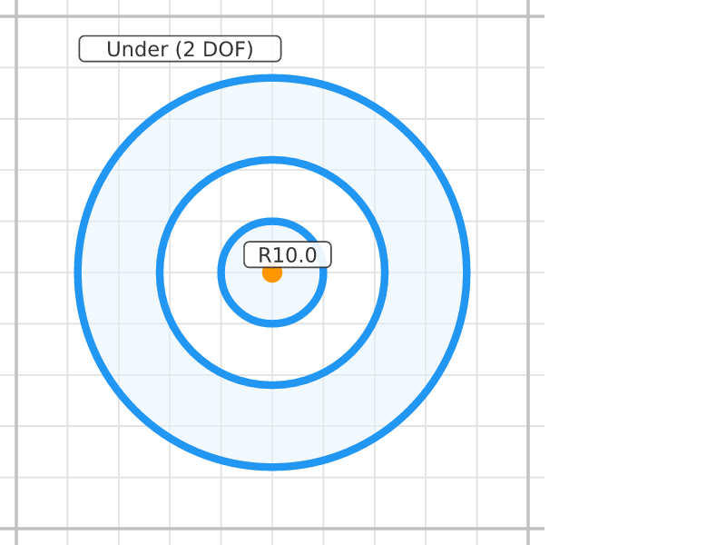
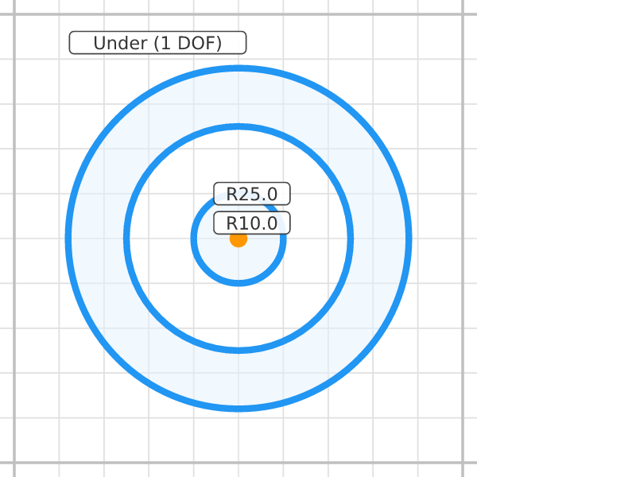
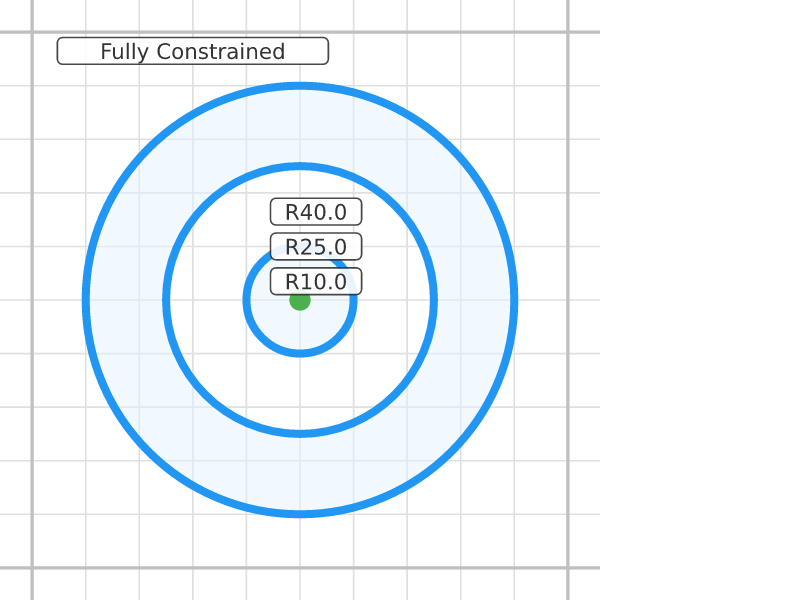
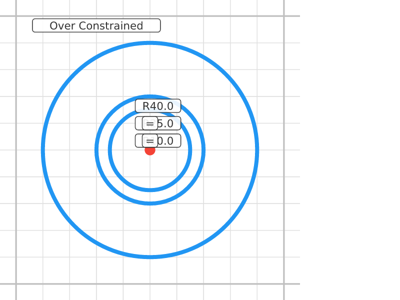

# Bolt Circle Pattern

## Step 0: Center Point
**Status**: Under-constrained (2 DOF) | **Entities**: 1 pt | **Constraints**: 0
> Single center point for the concentric circles.

| Point | X | Y |
|-------|-------|-------|
| P1 | 50.00 | 50.00 |

---

## Step 1: Three Circles
**Status**: Under-constrained (5 DOF) | **Entities**: 1 pt, 3 cir | **Constraints**: 0
> Three concentric circles at rough radii. All share the center point. Radii and center position free.

| Point | X | Y |
|-------|-------|-------|
| P1 | 50.00 | 50.00 |

**Profiles detected**: 3 closed profile(s)

---

## Step 2: Center Pinned
**Status**: Under-constrained (3 DOF) | **Entities**: 1 pt, 3 cir | **Constraints**: 1
> Center pinned at (50, 50). Only radii remain free.

**Active constraints**:
- Dragged(P1)

| Point | X | Y |
|-------|-------|-------|
| P1 | 50.00 | 50.00 |

**Profiles detected**: 3 closed profile(s)

---

## Step 3: Inner Radius
**Status**: Under-constrained (2 DOF) | **Entities**: 1 pt, 3 cir | **Constraints**: 2
> Inner circle constrained to R=10mm (bolt hole).

**Active constraints**:
- Dragged(P1)
- Radius(E10, 10.0mm)

| Point | X | Y |
|-------|-------|-------|
| P1 | 50.00 | 50.00 |

**Profiles detected**: 3 closed profile(s)

---

## Step 4: Middle Radius
**Status**: Under-constrained (1 DOF) | **Entities**: 1 pt, 3 cir | **Constraints**: 3
> Middle circle constrained to R=25mm (bolt circle diameter).

**Active constraints**:
- Dragged(P1)
- Radius(E10, 10.0mm)
- Radius(E11, 25.0mm)

| Point | X | Y |
|-------|-------|-------|
| P1 | 50.00 | 50.00 |

**Profiles detected**: 3 closed profile(s)

---

## Step 5: Outer Radius
**Status**: Fully constrained (0 DOF) | **Entities**: 1 pt, 3 cir | **Constraints**: 4
> Outer circle constrained to R=40mm (flange edge). All radii defined.

**Active constraints**:
- Dragged(P1)
- Radius(E10, 10.0mm)
- Radius(E11, 25.0mm)
- Radius(E12, 40.0mm)

| Point | X | Y |
|-------|-------|-------|
| P1 | 50.00 | 50.00 |

**Profiles detected**: 3 closed profile(s)

---

## Step 6: Equal Radii
**Status**: Over-constrained (3 conflicts) | **Entities**: 1 pt, 3 cir | **Constraints**: 5
> Equal constraint forces inner and middle circles to same radius. Over-constrains unless we remove one radius — demonstrates the over-constrained state.

**Active constraints**:
- Dragged(P1)
- Radius(E10, 10.0mm)
- Radius(E11, 25.0mm)
- Radius(E12, 40.0mm)
- Equal(E10, E11)

| Point | X | Y |
|-------|-------|-------|
| P1 | 50.00 | 50.00 |

---
