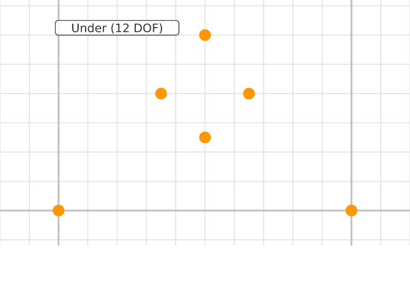
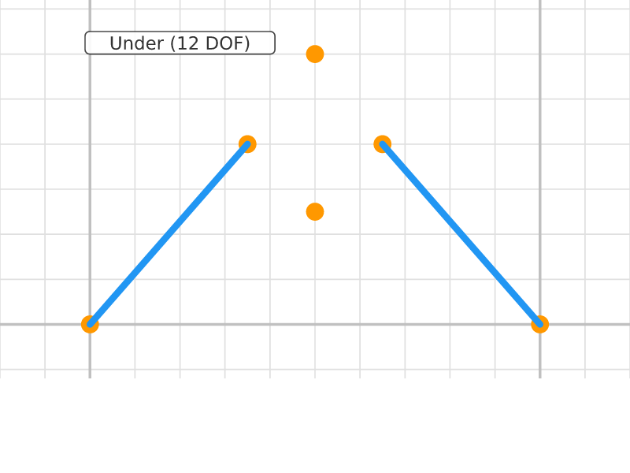
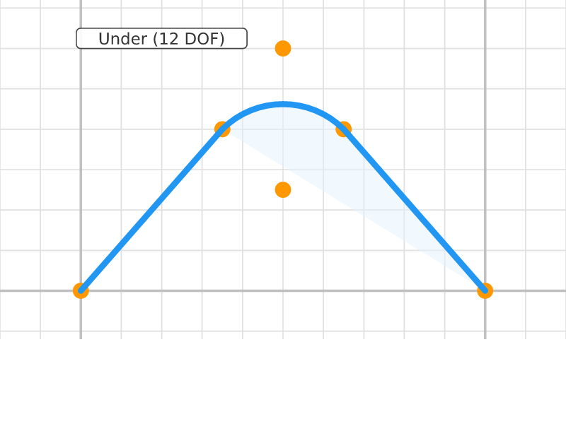
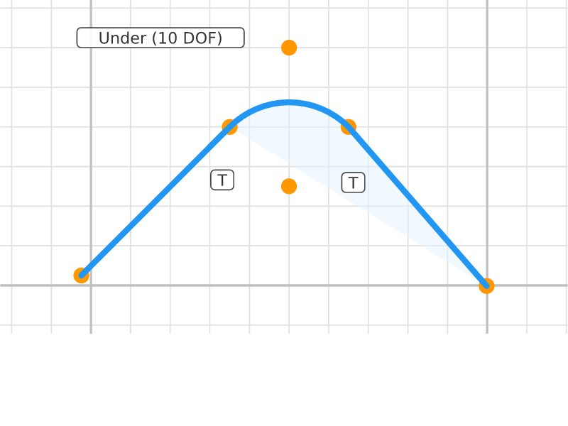
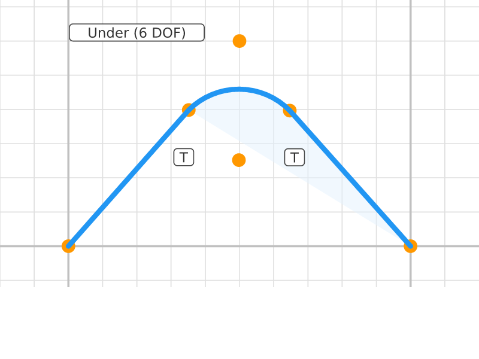
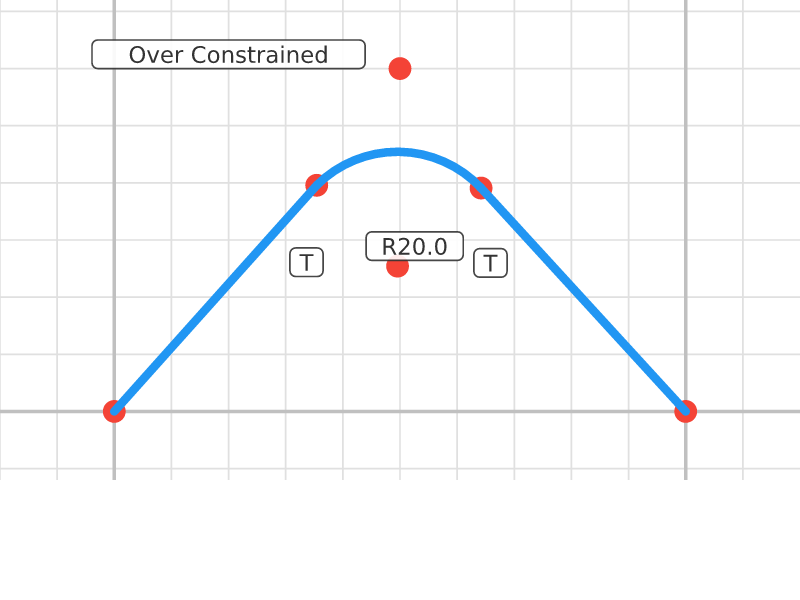
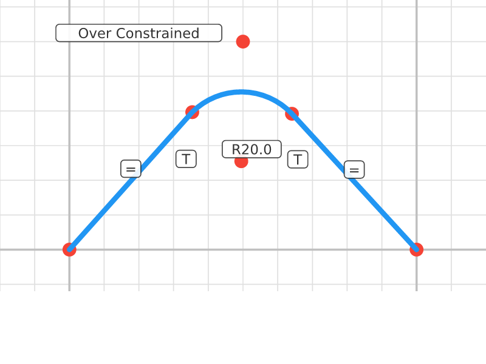

# Tangent Arc Transition

## Step 0: V Points
**Status**: Under-constrained (12 DOF) | **Entities**: 6 pt | **Constraints**: 0
> Six points: two line endpoints, V-apex, arc center and connection points.

| Point | X | Y |
|-------|-------|-------|
| P1 | 0.00 | 0.00 |
| P2 | 50.00 | 60.00 |
| P3 | 100.00 | 0.00 |
| P4 | 35.00 | 40.00 |
| P5 | 65.00 | 40.00 |
| P6 | 50.00 | 25.00 |

---

## Step 1: V Lines
**Status**: Under-constrained (12 DOF) | **Entities**: 6 pt, 2 ln | **Constraints**: 0
> Two line segments forming the arms of a V-shape. Arc will bridge the gap at the top.

| Point | X | Y |
|-------|-------|-------|
| P1 | 0.00 | 0.00 |
| P2 | 50.00 | 60.00 |
| P3 | 100.00 | 0.00 |
| P4 | 35.00 | 40.00 |
| P5 | 65.00 | 40.00 |
| P6 | 50.00 | 25.00 |

---

## Step 2: Arc Added
**Status**: Under-constrained (12 DOF) | **Entities**: 6 pt, 2 ln, 1 arc | **Constraints**: 0
> Arc added connecting the tops of both line segments. Creates a smooth transition path.

| Point | X | Y |
|-------|-------|-------|
| P1 | 0.00 | 0.00 |
| P2 | 50.00 | 60.00 |
| P3 | 100.00 | 0.00 |
| P4 | 35.00 | 40.00 |
| P5 | 65.00 | 40.00 |
| P6 | 50.00 | 25.00 |

**Profiles detected**: 1 closed profile(s)

---

## Step 3: Tangent Constrained
**Status**: Under-constrained (10 DOF) | **Entities**: 6 pt, 2 ln, 1 arc | **Constraints**: 2
> Tangent constraints at both line-arc junctions. Arc now smoothly transitions between the two lines.

**Active constraints**:
- Tangent(E10, E20)
- Tangent(E11, E20)

| Point | X | Y |
|-------|-------|-------|
| P1 | -2.43 | 2.49 |
| P2 | 50.00 | 60.00 |
| P3 | 99.87 | -0.15 |
| P4 | 35.02 | 39.98 |
| P5 | 65.00 | 40.00 |
| P6 | 49.98 | 25.02 |

**Profiles detected**: 1 closed profile(s)

---

## Step 4: Bases Pinned
**Status**: Under-constrained (6 DOF) | **Entities**: 6 pt, 2 ln, 1 arc | **Constraints**: 4
> Base points of both lines pinned. Shape position fixed, arc geometry adjusting to tangency.

**Active constraints**:
- Tangent(E10, E20)
- Tangent(E11, E20)
- Dragged(P1)
- Dragged(P3)

| Point | X | Y |
|-------|-------|-------|
| P1 | -0.00 | 0.00 |
| P2 | 50.00 | 60.00 |
| P3 | 100.00 | -0.00 |
| P4 | 35.17 | 39.83 |
| P5 | 64.69 | 39.65 |
| P6 | 49.83 | 25.17 |

**Profiles detected**: 1 closed profile(s)

---

## Step 5: Arc Radius Set
**Status**: Over-constrained (3 conflicts) | **Entities**: 6 pt, 2 ln, 1 arc | **Constraints**: 5
> Arc radius constrained to 20mm. Shape position and arc size fixed.

**Active constraints**:
- Tangent(E10, E20)
- Tangent(E11, E20)
- Dragged(P1)
- Dragged(P3)
- Radius(E20, 20.0mm)

| Point | X | Y |
|-------|-------|-------|
| P1 | 0.00 | -0.00 |
| P2 | 50.00 | 60.00 |
| P3 | 100.00 | -0.00 |
| P4 | 35.43 | 39.57 |
| P5 | 64.19 | 39.09 |
| P6 | 49.57 | 25.43 |

---

## Step 6: Symmetric V
**Status**: Over-constrained (3 conflicts) | **Entities**: 6 pt, 2 ln, 1 arc | **Constraints**: 6
> Equal line lengths make V-shape symmetric. Tangent arc transition fully defined.

**Active constraints**:
- Tangent(E10, E20)
- Tangent(E11, E20)
- Dragged(P1)
- Dragged(P3)
- Radius(E20, 20.0mm)
- Equal(E10, E11)

| Point | X | Y |
|-------|-------|-------|
| P1 | 0.00 | -0.00 |
| P2 | 50.00 | 60.00 |
| P3 | 100.00 | 0.00 |
| P4 | 35.38 | 39.65 |
| P5 | 64.10 | 39.18 |
| P6 | 49.51 | 25.49 |

---
