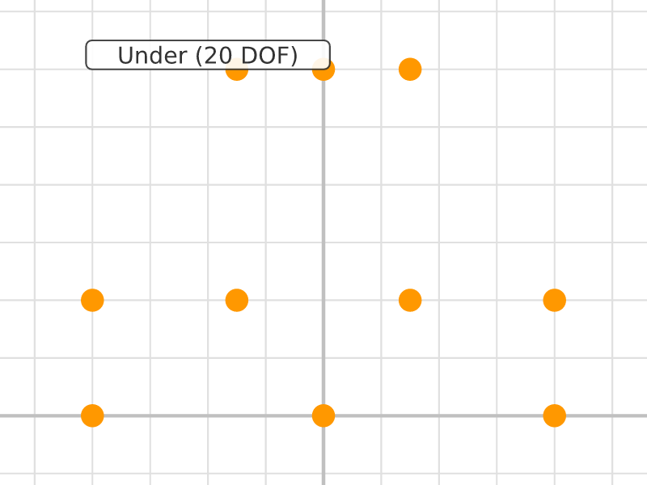
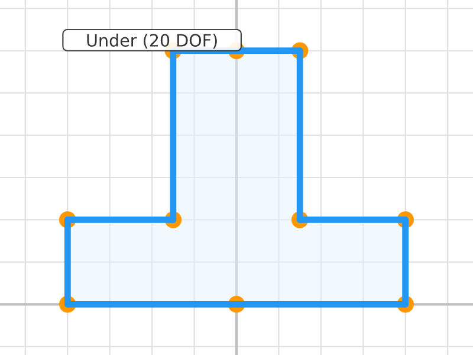
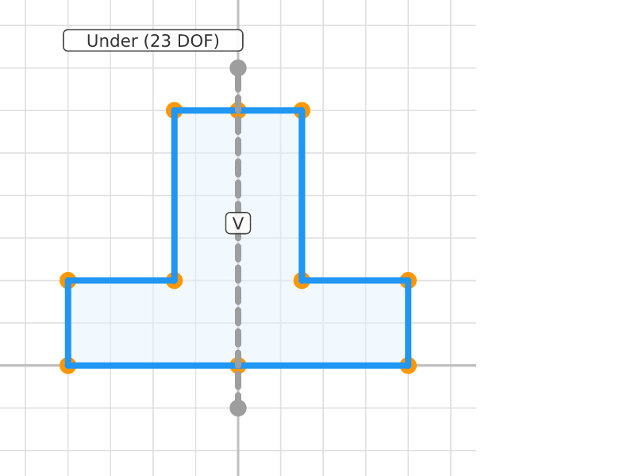
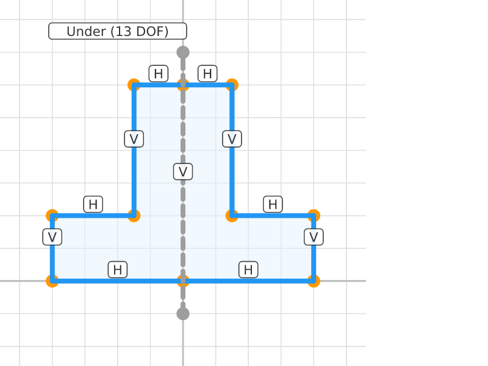
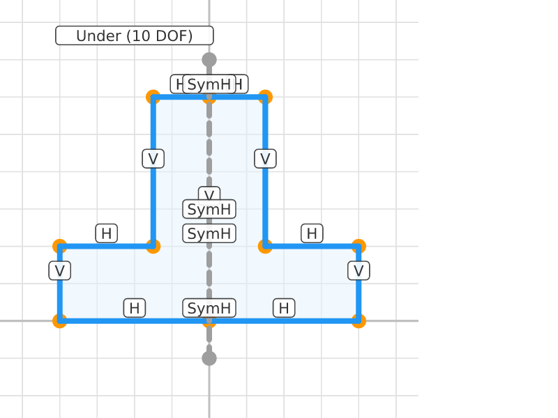
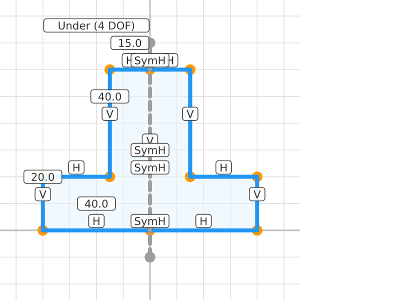

# Symmetric Mounting Bracket

## Step 0: Bracket Points
**Status**: Under-constrained (20 DOF) | **Entities**: 10 pt | **Constraints**: 0
> Ten points: 6 for the left half of an L-bracket, 4 mirrored on the right. Point 1 and 6 lie on the Y-axis.

| Point | X | Y |
|-------|-------|-------|
| P1 | 0.00 | 0.00 |
| P2 | -40.00 | 0.00 |
| P3 | -40.00 | 20.00 |
| P4 | -15.00 | 20.00 |
| P5 | -15.00 | 60.00 |
| P6 | 0.00 | 60.00 |
| P7 | 40.00 | 0.00 |
| P8 | 40.00 | 20.00 |
| P9 | 15.00 | 20.00 |
| P10 | 15.00 | 60.00 |

---

## Step 1: Bracket Lines
**Status**: Under-constrained (20 DOF) | **Entities**: 10 pt, 10 ln | **Constraints**: 0
> Ten lines forming a closed symmetric L-bracket profile. Left and right halves share points 1 (bottom) and 6 (top) on the Y-axis.

| Point | X | Y |
|-------|-------|-------|
| P1 | 0.00 | 0.00 |
| P2 | -40.00 | 0.00 |
| P3 | -40.00 | 20.00 |
| P4 | -15.00 | 20.00 |
| P5 | -15.00 | 60.00 |
| P6 | 0.00 | 60.00 |
| P7 | 40.00 | 0.00 |
| P8 | 40.00 | 20.00 |
| P9 | 15.00 | 20.00 |
| P10 | 15.00 | 60.00 |

**Profiles detected**: 1 closed profile(s)

---

## Step 2: Construction Line
**Status**: Under-constrained (23 DOF) | **Entities**: 12 pt, 11 ln | **Constraints**: 1
> Vertical construction line on Y-axis added as symmetry reference. Rendered with grey dashed stroke.

**Active constraints**:
- Vertical(E60)

| Point | X | Y |
|-------|-------|-------|
| P1 | 0.00 | 0.00 |
| P2 | -40.00 | 0.00 |
| P3 | -40.00 | 20.00 |
| P4 | -15.00 | 20.00 |
| P5 | -15.00 | 60.00 |
| P6 | 0.00 | 60.00 |
| P7 | 40.00 | 0.00 |
| P8 | 40.00 | 20.00 |
| P9 | 15.00 | 20.00 |
| P10 | 15.00 | 60.00 |
| P50 | 0.00 | -10.00 |
| P51 | 0.00 | 70.00 |

**Profiles detected**: 1 closed profile(s)

---

## Step 3: Hv Constrained
**Status**: Under-constrained (13 DOF) | **Entities**: 12 pt, 11 ln | **Constraints**: 11
> All bracket edges forced horizontal or vertical. Shape is axis-aligned but size/position still free.

**Active constraints**:
- Vertical(E60)
- Horizontal(E20)
- Horizontal(E22)
- Horizontal(E24)
- Horizontal(E25)
- Horizontal(E27)
- Horizontal(E29)
- Vertical(E21)
- Vertical(E23)
- Vertical(E26)
- Vertical(E28)

| Point | X | Y |
|-------|-------|-------|
| P1 | 0.00 | 0.00 |
| P2 | -40.00 | 0.00 |
| P3 | -40.00 | 20.00 |
| P4 | -15.00 | 20.00 |
| P5 | -15.00 | 60.00 |
| P6 | 0.00 | 60.00 |
| P7 | 40.00 | 0.00 |
| P8 | 40.00 | 20.00 |
| P9 | 15.00 | 20.00 |
| P10 | 15.00 | 60.00 |
| P50 | 0.00 | -10.00 |
| P51 | 0.00 | 70.00 |

**Profiles detected**: 1 closed profile(s)

---

## Step 4: Symmetric
**Status**: Under-constrained (10 DOF) | **Entities**: 12 pt, 11 ln | **Constraints**: 15
> SymmetricH constraints mirror 4 point pairs across the Y-axis. Right half now exactly mirrors left half.

**Active constraints**:
- Vertical(E60)
- Horizontal(E20)
- Horizontal(E22)
- Horizontal(E24)
- Horizontal(E25)
- Horizontal(E27)
- Horizontal(E29)
- Vertical(E21)
- Vertical(E23)
- Vertical(E26)
- Vertical(E28)
- SymmetricH(P2, P7)
- SymmetricH(P3, P8)
- SymmetricH(P4, P9)
- SymmetricH(P5, P10)

| Point | X | Y |
|-------|-------|-------|
| P1 | 0.00 | 0.00 |
| P2 | -40.00 | 0.00 |
| P3 | -40.00 | 20.00 |
| P4 | -15.00 | 20.00 |
| P5 | -15.00 | 60.00 |
| P6 | 0.00 | 60.00 |
| P7 | 40.00 | 0.00 |
| P8 | 40.00 | 20.00 |
| P9 | 15.00 | 20.00 |
| P10 | 15.00 | 60.00 |
| P50 | 0.00 | -10.00 |
| P51 | 0.00 | 70.00 |

**Profiles detected**: 1 closed profile(s)

---

## Step 5: Fully Constrained
**Status**: Under-constrained (4 DOF) | **Entities**: 12 pt, 11 ln | **Constraints**: 20
> Origin pinned, dimensions added (width 80mm, base height 20mm, arm height 40mm, arm width 15mm). Fully constrained symmetric bracket.

**Active constraints**:
- Vertical(E60)
- Horizontal(E20)
- Horizontal(E22)
- Horizontal(E24)
- Horizontal(E25)
- Horizontal(E27)
- Horizontal(E29)
- Vertical(E21)
- Vertical(E23)
- Vertical(E26)
- Vertical(E28)
- SymmetricH(P2, P7)
- SymmetricH(P3, P8)
- SymmetricH(P4, P9)
- SymmetricH(P5, P10)
- Dragged(P1)
- Distance(E1, E2, 40.0mm)
- Distance(E2, E3, 20.0mm)
- Distance(E4, E5, 40.0mm)
- Distance(E5, E6, 15.0mm)

| Point | X | Y |
|-------|-------|-------|
| P1 | 0.00 | 0.00 |
| P2 | -40.00 | 0.00 |
| P3 | -40.00 | 20.00 |
| P4 | -15.00 | 20.00 |
| P5 | -15.00 | 60.00 |
| P6 | 0.00 | 60.00 |
| P7 | 40.00 | 0.00 |
| P8 | 40.00 | 20.00 |
| P9 | 15.00 | 20.00 |
| P10 | 15.00 | 60.00 |
| P50 | 0.00 | -10.00 |
| P51 | 0.00 | 70.00 |

**Profiles detected**: 1 closed profile(s)

---
