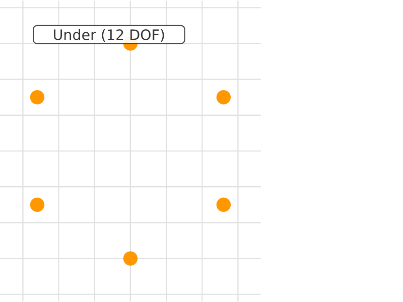
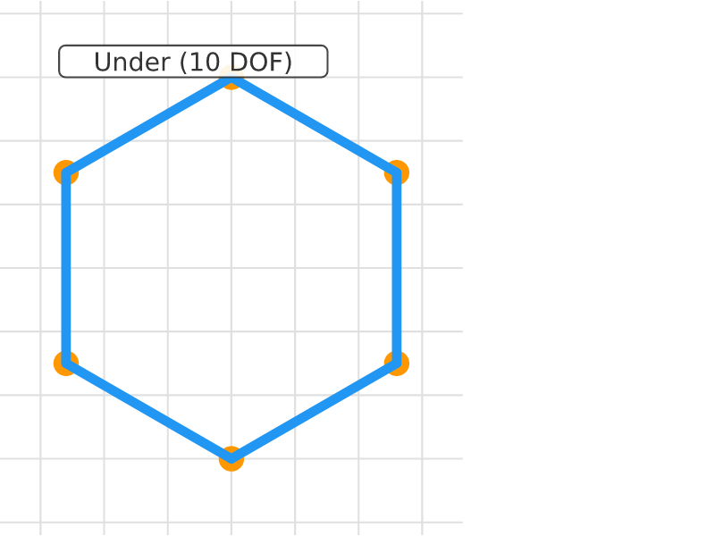
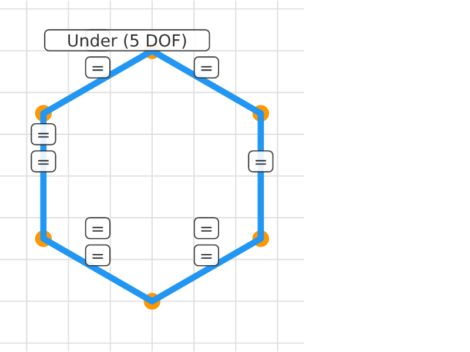
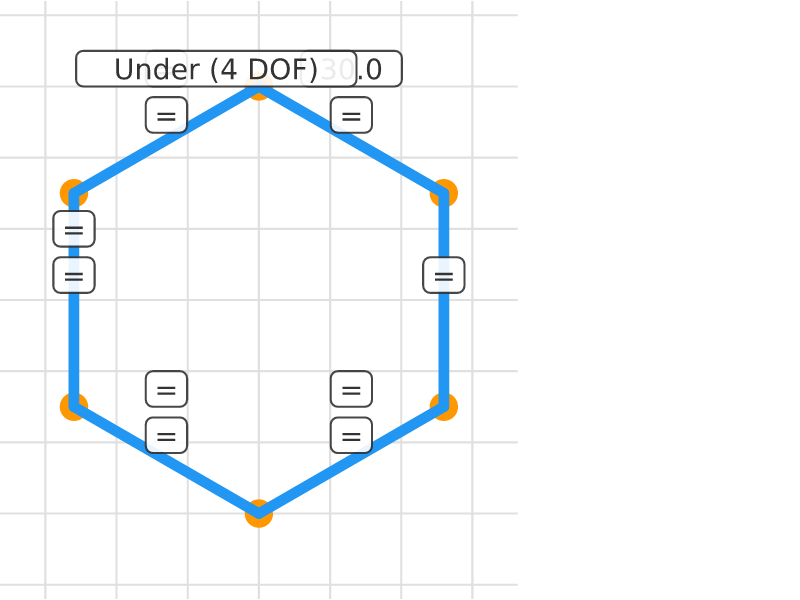
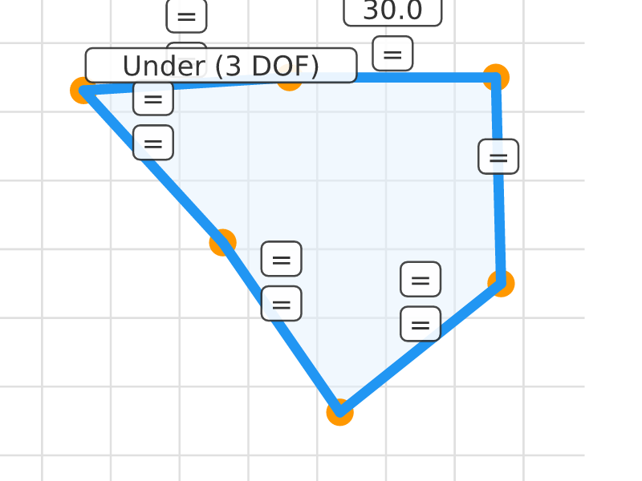

# Hex Bolt Head

## Step 0: Hex Points
**Status**: Under-constrained (12 DOF) | **Entities**: 6 pt | **Constraints**: 0
> Six points arranged roughly as a hexagon. Positions approximate — constraint solving will regularize them.

| Point | X | Y |
|-------|-------|-------|
| P1 | 75.98 | 65.00 |
| P2 | 50.00 | 80.00 |
| P3 | 24.02 | 65.00 |
| P4 | 24.02 | 35.00 |
| P5 | 50.00 | 20.00 |
| P6 | 75.98 | 35.00 |

---

## Step 1: Hex Lines
**Status**: Under-constrained (12 DOF) | **Entities**: 6 pt, 6 ln | **Constraints**: 0
> Six lines connecting adjacent points into a closed hexagonal loop.

| Point | X | Y |
|-------|-------|-------|
| P1 | 75.98 | 65.00 |
| P2 | 50.00 | 80.00 |
| P3 | 24.02 | 65.00 |
| P4 | 24.02 | 35.00 |
| P5 | 50.00 | 20.00 |
| P6 | 75.98 | 35.00 |

**Profiles detected**: 2 closed profile(s)

---

## Step 2: Vertex Pinned
**Status**: Under-constrained (10 DOF) | **Entities**: 6 pt, 6 ln | **Constraints**: 1
> First vertex pinned. Hexagon can still rotate, scale, and deform.

**Active constraints**:
- Dragged(P1)

| Point | X | Y |
|-------|-------|-------|
| P1 | 75.98 | 65.00 |
| P2 | 50.00 | 80.00 |
| P3 | 24.02 | 65.00 |
| P4 | 24.02 | 35.00 |
| P5 | 50.00 | 20.00 |
| P6 | 75.98 | 35.00 |

**Profiles detected**: 2 closed profile(s)

---

## Step 3: Equal Sides
**Status**: Under-constrained (5 DOF) | **Entities**: 6 pt, 6 ln | **Constraints**: 6
> Equal-length chain: all six sides forced to same length. Shape regularizing toward regular hexagon.

**Active constraints**:
- Dragged(P1)
- Equal(E10, E11)
- Equal(E11, E12)
- Equal(E12, E13)
- Equal(E13, E14)
- Equal(E14, E15)

| Point | X | Y |
|-------|-------|-------|
| P1 | 75.98 | 65.00 |
| P2 | 50.00 | 80.00 |
| P3 | 24.02 | 65.00 |
| P4 | 24.02 | 35.00 |
| P5 | 50.00 | 20.00 |
| P6 | 75.98 | 35.00 |

**Profiles detected**: 2 closed profile(s)

---

## Step 4: Side Length
**Status**: Under-constrained (4 DOF) | **Entities**: 6 pt, 6 ln | **Constraints**: 7
> First side constrained to 30mm. All sides now 30mm via equal chain. Size is fixed.

**Active constraints**:
- Dragged(P1)
- Equal(E10, E11)
- Equal(E11, E12)
- Equal(E12, E13)
- Equal(E13, E14)
- Equal(E14, E15)
- Distance(E1, E2, 30.0mm)

| Point | X | Y |
|-------|-------|-------|
| P1 | 75.98 | 65.00 |
| P2 | 50.00 | 80.00 |
| P3 | 24.02 | 65.00 |
| P4 | 24.02 | 35.00 |
| P5 | 50.00 | 20.00 |
| P6 | 75.98 | 35.00 |

**Profiles detected**: 2 closed profile(s)

---

## Step 5: Rotation Fixed
**Status**: Under-constrained (3 DOF) | **Entities**: 6 pt, 6 ln | **Constraints**: 8
> Bottom side forced horizontal, fixing the hexagon's rotation. Fully constrained regular hexagon.

**Active constraints**:
- Dragged(P1)
- Equal(E10, E11)
- Equal(E11, E12)
- Equal(E12, E13)
- Equal(E13, E14)
- Equal(E14, E15)
- Distance(E1, E2, 30.0mm)
- Horizontal(E10)

| Point | X | Y |
|-------|-------|-------|
| P1 | 75.98 | 65.00 |
| P2 | 45.98 | 65.00 |
| P3 | 16.04 | 63.11 |
| P4 | 36.28 | 40.96 |
| P5 | 53.32 | 16.27 |
| P6 | 76.74 | 35.01 |

**Profiles detected**: 1 closed profile(s)

---
