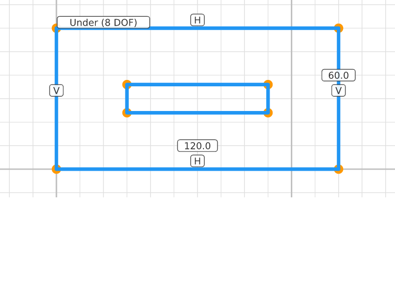
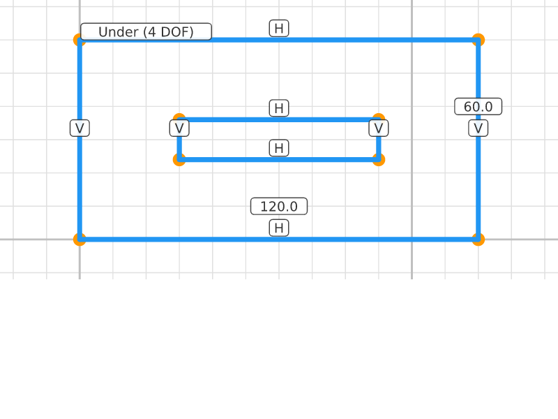
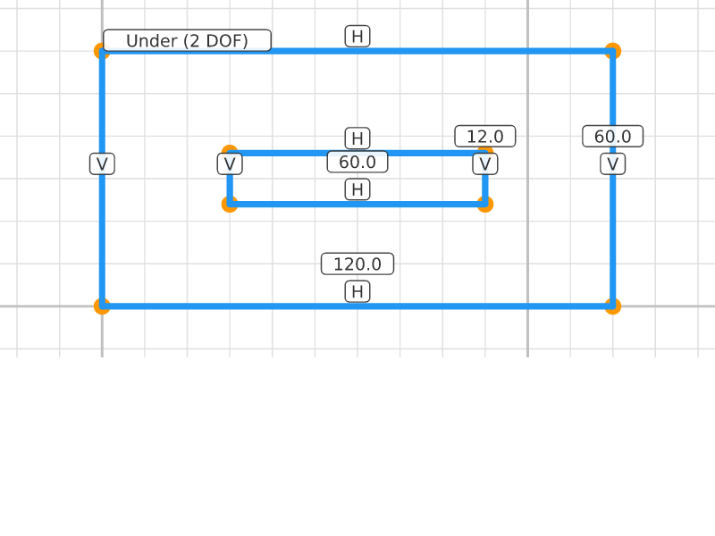
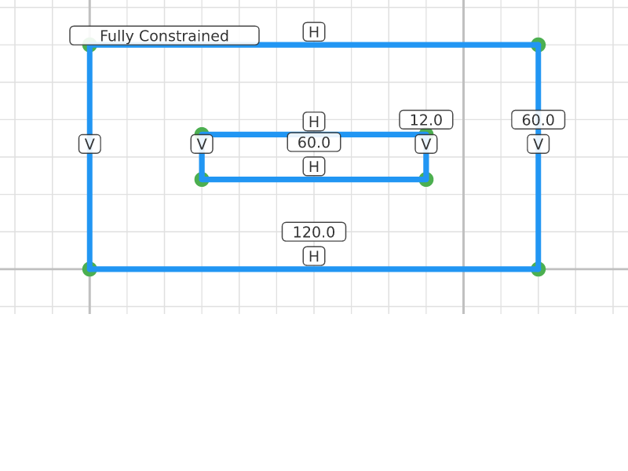

# Slotted Plate

## Step 0: Plate Corners
**Status**: Under-constrained (8 DOF) | **Entities**: 4 pt | **Constraints**: 0
> Four corners of the outer plate rectangle.

| Point | X | Y |
|-------|-------|-------|
| P1 | 0.00 | 0.00 |
| P2 | 120.00 | 0.00 |
| P3 | 120.00 | 60.00 |
| P4 | 0.00 | 60.00 |

---

## Step 1: Plate Outline
**Status**: Under-constrained (8 DOF) | **Entities**: 4 pt, 4 ln | **Constraints**: 0
> Closed rectangular outline for the plate body.

| Point | X | Y |
|-------|-------|-------|
| P1 | 0.00 | 0.00 |
| P2 | 120.00 | 0.00 |
| P3 | 120.00 | 60.00 |
| P4 | 0.00 | 60.00 |

**Profiles detected**: 2 closed profile(s)

---

## Step 2: Plate Constrained
**Status**: Fully constrained (0 DOF) | **Entities**: 4 pt, 4 ln | **Constraints**: 7
> Outer rectangle fully constrained: 120x60mm at origin. Now adding the slot cutout.

**Active constraints**:
- Horizontal(E10)
- Horizontal(E12)
- Vertical(E11)
- Vertical(E13)
- Dragged(P1)
- Distance(E1, E2, 120.0mm)
- Distance(E2, E3, 60.0mm)

| Point | X | Y |
|-------|-------|-------|
| P1 | 0.00 | 0.00 |
| P2 | 120.00 | 0.00 |
| P3 | 120.00 | 60.00 |
| P4 | 0.00 | 60.00 |

**Profiles detected**: 2 closed profile(s)

---

## Step 3: Slot Points
**Status**: Under-constrained (8 DOF) | **Entities**: 8 pt, 4 ln | **Constraints**: 7
> Four points for a rectangular slot cutout, roughly centered in the plate.

**Active constraints**:
- Horizontal(E10)
- Horizontal(E12)
- Vertical(E11)
- Vertical(E13)
- Dragged(P1)
- Distance(E1, E2, 120.0mm)
- Distance(E2, E3, 60.0mm)

| Point | X | Y |
|-------|-------|-------|
| P1 | 0.00 | 0.00 |
| P2 | 120.00 | 0.00 |
| P3 | 120.00 | 60.00 |
| P4 | 0.00 | 60.00 |
| P20 | 30.00 | 24.00 |
| P21 | 90.00 | 24.00 |
| P22 | 90.00 | 36.00 |
| P23 | 30.00 | 36.00 |

**Profiles detected**: 2 closed profile(s)

---

## Step 4: Slot Outline
**Status**: Under-constrained (8 DOF) | **Entities**: 8 pt, 8 ln | **Constraints**: 7
> Rectangular slot outline added inside the plate. Two closed profiles now visible.

**Active constraints**:
- Horizontal(E10)
- Horizontal(E12)
- Vertical(E11)
- Vertical(E13)
- Dragged(P1)
- Distance(E1, E2, 120.0mm)
- Distance(E2, E3, 60.0mm)

| Point | X | Y |
|-------|-------|-------|
| P1 | 0.00 | 0.00 |
| P2 | 120.00 | 0.00 |
| P3 | 120.00 | 60.00 |
| P4 | 0.00 | 60.00 |
| P20 | 30.00 | 24.00 |
| P21 | 90.00 | 24.00 |
| P22 | 90.00 | 36.00 |
| P23 | 30.00 | 36.00 |

**Profiles detected**: 4 closed profile(s)

---

## Step 5: Slot Aligned
**Status**: Under-constrained (4 DOF) | **Entities**: 8 pt, 8 ln | **Constraints**: 11
> Slot sides constrained horizontal/vertical. Slot axis-aligned within the plate.

**Active constraints**:
- Horizontal(E10)
- Horizontal(E12)
- Vertical(E11)
- Vertical(E13)
- Dragged(P1)
- Distance(E1, E2, 120.0mm)
- Distance(E2, E3, 60.0mm)
- Horizontal(E30)
- Horizontal(E32)
- Vertical(E31)
- Vertical(E33)

| Point | X | Y |
|-------|-------|-------|
| P1 | 0.00 | 0.00 |
| P2 | 120.00 | 0.00 |
| P3 | 120.00 | 60.00 |
| P4 | 0.00 | 60.00 |
| P20 | 30.00 | 24.00 |
| P21 | 90.00 | 24.00 |
| P22 | 90.00 | 36.00 |
| P23 | 30.00 | 36.00 |

**Profiles detected**: 4 closed profile(s)

---

## Step 6: Slot Sized
**Status**: Under-constrained (2 DOF) | **Entities**: 8 pt, 8 ln | **Constraints**: 13
> Slot dimensions set: 60mm long x 12mm wide. Position still free within the plate.

**Active constraints**:
- Horizontal(E10)
- Horizontal(E12)
- Vertical(E11)
- Vertical(E13)
- Dragged(P1)
- Distance(E1, E2, 120.0mm)
- Distance(E2, E3, 60.0mm)
- Horizontal(E30)
- Horizontal(E32)
- Vertical(E31)
- Vertical(E33)
- Distance(E20, E21, 60.0mm)
- Distance(E21, E22, 12.0mm)

| Point | X | Y |
|-------|-------|-------|
| P1 | 0.00 | 0.00 |
| P2 | 120.00 | 0.00 |
| P3 | 120.00 | 60.00 |
| P4 | 0.00 | 60.00 |
| P20 | 30.00 | 24.00 |
| P21 | 90.00 | 24.00 |
| P22 | 90.00 | 36.00 |
| P23 | 30.00 | 36.00 |

**Profiles detected**: 4 closed profile(s)

---

## Step 7: Slot Positioned
**Status**: Fully constrained (0 DOF) | **Entities**: 8 pt, 8 ln | **Constraints**: 14
> Slot bottom-left pinned at (30, 24). Fully constrained compound plate with rectangular slot.

**Active constraints**:
- Horizontal(E10)
- Horizontal(E12)
- Vertical(E11)
- Vertical(E13)
- Dragged(P1)
- Distance(E1, E2, 120.0mm)
- Distance(E2, E3, 60.0mm)
- Horizontal(E30)
- Horizontal(E32)
- Vertical(E31)
- Vertical(E33)
- Distance(E20, E21, 60.0mm)
- Distance(E21, E22, 12.0mm)
- Dragged(P20)

| Point | X | Y |
|-------|-------|-------|
| P1 | 0.00 | 0.00 |
| P2 | 120.00 | 0.00 |
| P3 | 120.00 | 60.00 |
| P4 | 0.00 | 60.00 |
| P20 | 30.00 | 24.00 |
| P21 | 90.00 | 24.00 |
| P22 | 90.00 | 36.00 |
| P23 | 30.00 | 36.00 |

**Profiles detected**: 4 closed profile(s)

---
