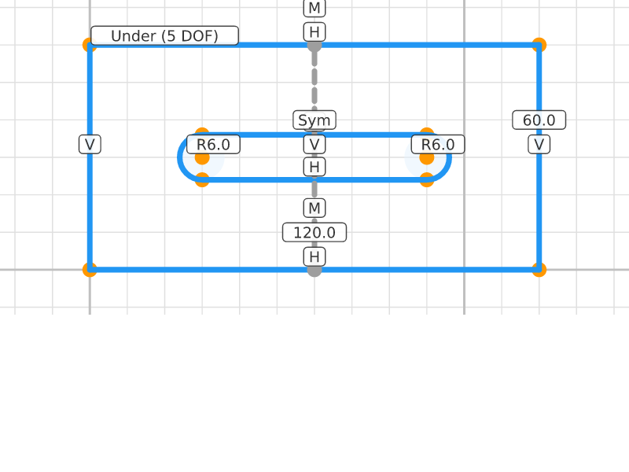
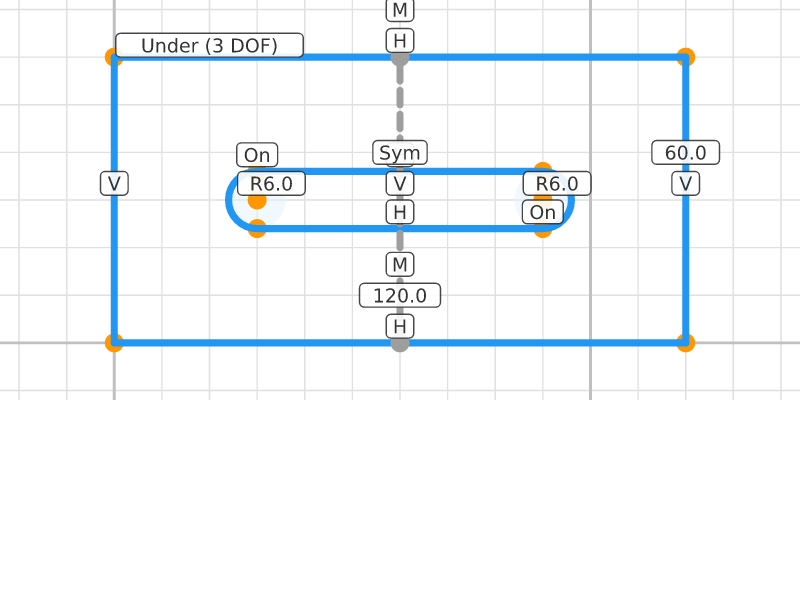
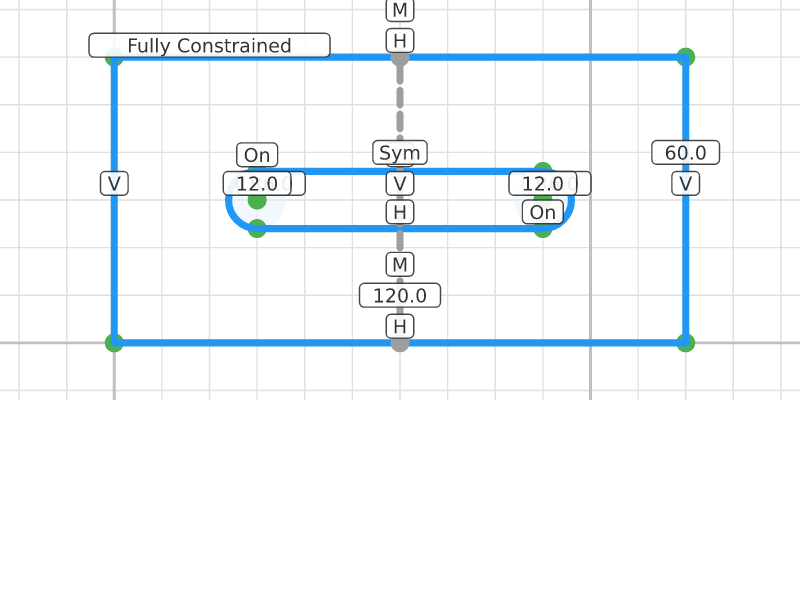

# Slotted Plate

## Step 0: Plate Corners
**Status**: Under-constrained (8 DOF) | **Entities**: 4 pt | **Constraints**: 0
> Four corners of the outer plate rectangle.

| Point | X | Y |
|-------|-------|-------|
| P1 | 0.00 | 0.00 |
| P2 | 120.00 | 0.00 |
| P3 | 120.00 | 60.00 |
| P4 | 0.00 | 60.00 |

---

## Step 1: Plate Outline
**Status**: Under-constrained (8 DOF) | **Entities**: 4 pt, 4 ln | **Constraints**: 0
> Closed rectangular outline for the plate body.

| Point | X | Y |
|-------|-------|-------|
| P1 | 0.00 | 0.00 |
| P2 | 120.00 | 0.00 |
| P3 | 120.00 | 60.00 |
| P4 | 0.00 | 60.00 |

**Profiles detected**: 2 closed profile(s)

---

## Step 2: Plate Constrained
**Status**: Fully constrained (0 DOF) | **Entities**: 4 pt, 4 ln | **Constraints**: 7
> Outer rectangle fully constrained: 120x60mm at origin. Now adding the stadium slot.

**Active constraints**:
- Horizontal(E10)
- Horizontal(E12)
- Vertical(E11)
- Vertical(E13)
- Dragged(P1)
- Distance(E1, E2, 120.0mm)
- Distance(E2, E3, 60.0mm)

| Point | X | Y |
|-------|-------|-------|
| P1 | 0.00 | 0.00 |
| P2 | 120.00 | 0.00 |
| P3 | 120.00 | 60.00 |
| P4 | 0.00 | 60.00 |

**Profiles detected**: 2 closed profile(s)

---

## Step 3: Slot Points
**Status**: Under-constrained (12 DOF) | **Entities**: 10 pt, 4 ln | **Constraints**: 7
> Six points for the stadium slot: left cap (top P20, bottom P21, center P22) and right cap (top P23, bottom P24, center P25).

**Active constraints**:
- Horizontal(E10)
- Horizontal(E12)
- Vertical(E11)
- Vertical(E13)
- Dragged(P1)
- Distance(E1, E2, 120.0mm)
- Distance(E2, E3, 60.0mm)

| Point | X | Y |
|-------|-------|-------|
| P1 | 0.00 | 0.00 |
| P2 | 120.00 | 0.00 |
| P3 | 120.00 | 60.00 |
| P4 | 0.00 | 60.00 |
| P20 | 30.00 | 36.00 |
| P21 | 30.00 | 24.00 |
| P22 | 30.00 | 30.00 |
| P23 | 90.00 | 36.00 |
| P24 | 90.00 | 24.00 |
| P25 | 90.00 | 30.00 |

**Profiles detected**: 2 closed profile(s)

---

## Step 4: Slot Shape
**Status**: Under-constrained (12 DOF) | **Entities**: 10 pt, 6 ln, 2 arc | **Constraints**: 7
> Stadium slot: two horizontal lines + two semicircular end caps. Closed loop: P20→P23 (top line) → arc right → P24→P21 (bottom line) → arc left → back to P20.

**Active constraints**:
- Horizontal(E10)
- Horizontal(E12)
- Vertical(E11)
- Vertical(E13)
- Dragged(P1)
- Distance(E1, E2, 120.0mm)
- Distance(E2, E3, 60.0mm)

| Point | X | Y |
|-------|-------|-------|
| P1 | 0.00 | 0.00 |
| P2 | 120.00 | 0.00 |
| P3 | 120.00 | 60.00 |
| P4 | 0.00 | 60.00 |
| P20 | 30.00 | 36.00 |
| P21 | 30.00 | 24.00 |
| P22 | 30.00 | 30.00 |
| P23 | 90.00 | 36.00 |
| P24 | 90.00 | 24.00 |
| P25 | 90.00 | 30.00 |

**Profiles detected**: 4 closed profile(s)

---

## Step 5: Slot Horizontal
**Status**: Under-constrained (10 DOF) | **Entities**: 10 pt, 6 ln, 2 arc | **Constraints**: 9
> Slot sides constrained horizontal. Slot is level within the plate.

**Active constraints**:
- Horizontal(E10)
- Horizontal(E12)
- Vertical(E11)
- Vertical(E13)
- Dragged(P1)
- Distance(E1, E2, 120.0mm)
- Distance(E2, E3, 60.0mm)
- Horizontal(E30)
- Horizontal(E31)

| Point | X | Y |
|-------|-------|-------|
| P1 | 0.00 | 0.00 |
| P2 | 120.00 | 0.00 |
| P3 | 120.00 | 60.00 |
| P4 | 0.00 | 60.00 |
| P20 | 30.00 | 36.00 |
| P21 | 30.00 | 24.00 |
| P22 | 30.00 | 30.00 |
| P23 | 90.00 | 36.00 |
| P24 | 90.00 | 24.00 |
| P25 | 90.00 | 30.00 |

**Profiles detected**: 4 closed profile(s)

---

## Step 6: Slot Radii
**Status**: Under-constrained (8 DOF) | **Entities**: 10 pt, 6 ln, 2 arc | **Constraints**: 11
> Both arc caps constrained to R=6mm. Slot width is now 12mm. Position and length still free.

**Active constraints**:
- Horizontal(E10)
- Horizontal(E12)
- Vertical(E11)
- Vertical(E13)
- Dragged(P1)
- Distance(E1, E2, 120.0mm)
- Distance(E2, E3, 60.0mm)
- Horizontal(E30)
- Horizontal(E31)
- Radius(E40, 6.0mm)
- Radius(E41, 6.0mm)

| Point | X | Y |
|-------|-------|-------|
| P1 | 0.00 | 0.00 |
| P2 | 120.00 | 0.00 |
| P3 | 120.00 | 60.00 |
| P4 | 0.00 | 60.00 |
| P20 | 30.00 | 36.00 |
| P21 | 30.00 | 24.00 |
| P22 | 30.00 | 30.00 |
| P23 | 90.00 | 36.00 |
| P24 | 90.00 | 24.00 |
| P25 | 90.00 | 30.00 |

**Profiles detected**: 4 closed profile(s)

---

## Step 7: Centerline
**Status**: Under-constrained (7 DOF) | **Entities**: 12 pt, 7 ln, 2 arc | **Constraints**: 14
> Construction line at plate center (x=60) via midpoint constraints on top/bottom plate edges. Will serve as symmetry axis for the slot.

**Active constraints**:
- Horizontal(E10)
- Horizontal(E12)
- Vertical(E11)
- Vertical(E13)
- Dragged(P1)
- Distance(E1, E2, 120.0mm)
- Distance(E2, E3, 60.0mm)
- Horizontal(E30)
- Horizontal(E31)
- Radius(E40, 6.0mm)
- Radius(E41, 6.0mm)
- Vertical(E60)
- Midpoint(P50, E10)
- Midpoint(P51, E12)

| Point | X | Y |
|-------|-------|-------|
| P1 | 0.00 | 0.00 |
| P2 | 120.00 | 0.00 |
| P3 | 120.00 | 60.00 |
| P4 | 0.00 | 60.00 |
| P20 | 30.00 | 36.00 |
| P21 | 30.00 | 24.00 |
| P22 | 30.00 | 30.00 |
| P23 | 90.00 | 36.00 |
| P24 | 90.00 | 24.00 |
| P25 | 90.00 | 30.00 |
| P50 | 60.00 | 0.00 |
| P51 | 60.00 | 60.00 |

**Profiles detected**: 4 closed profile(s)

---

## Step 8: Slot Symmetric
**Status**: Under-constrained (5 DOF) | **Entities**: 12 pt, 7 ln, 2 arc | **Constraints**: 15
> Slot centers constrained symmetric about the plate centerline. Slot is horizontally centered in the plate.

**Active constraints**:
- Horizontal(E10)
- Horizontal(E12)
- Vertical(E11)
- Vertical(E13)
- Dragged(P1)
- Distance(E1, E2, 120.0mm)
- Distance(E2, E3, 60.0mm)
- Horizontal(E30)
- Horizontal(E31)
- Radius(E40, 6.0mm)
- Radius(E41, 6.0mm)
- Vertical(E60)
- Midpoint(P50, E10)
- Midpoint(P51, E12)
- Symmetric(P22, P25, line=E60)

| Point | X | Y |
|-------|-------|-------|
| P1 | 0.00 | 0.00 |
| P2 | 120.00 | 0.00 |
| P3 | 120.00 | 60.00 |
| P4 | 0.00 | 60.00 |
| P20 | 30.00 | 36.00 |
| P21 | 30.00 | 24.00 |
| P22 | 30.00 | 30.00 |
| P23 | 90.00 | 36.00 |
| P24 | 90.00 | 24.00 |
| P25 | 90.00 | 30.00 |
| P50 | 60.00 | 0.00 |
| P51 | 60.00 | 60.00 |

**Profiles detected**: 4 closed profile(s)

---

## Step 9: End Points On Arcs
**Status**: Under-constrained (3 DOF) | **Entities**: 12 pt, 7 ln, 2 arc | **Constraints**: 17
> OnEntity constraints bind arc END points to their circles. (Start points are implicitly on-circle via RadiusDef::Implicit — but end points are free. This is a solver gap.)

**Active constraints**:
- Horizontal(E10)
- Horizontal(E12)
- Vertical(E11)
- Vertical(E13)
- Dragged(P1)
- Distance(E1, E2, 120.0mm)
- Distance(E2, E3, 60.0mm)
- Horizontal(E30)
- Horizontal(E31)
- Radius(E40, 6.0mm)
- Radius(E41, 6.0mm)
- Vertical(E60)
- Midpoint(P50, E10)
- Midpoint(P51, E12)
- Symmetric(P22, P25, line=E60)
- OnEntity(P20, E40)
- OnEntity(P24, E41)

| Point | X | Y |
|-------|-------|-------|
| P1 | 0.00 | 0.00 |
| P2 | 120.00 | 0.00 |
| P3 | 120.00 | 60.00 |
| P4 | 0.00 | 60.00 |
| P20 | 30.00 | 36.00 |
| P21 | 30.00 | 24.00 |
| P22 | 30.00 | 30.00 |
| P23 | 90.00 | 36.00 |
| P24 | 90.00 | 24.00 |
| P25 | 90.00 | 30.00 |
| P50 | 60.00 | 0.00 |
| P51 | 60.00 | 60.00 |

**Profiles detected**: 4 closed profile(s)

---

## Step 10: Slot Positioned
**Status**: Fully constrained (0 DOF) | **Entities**: 12 pt, 7 ln, 2 arc | **Constraints**: 20
> Left center pinned, endpoint spacing = 2R locks semicircular cap orientation. Compound plate with stadium slot.

**Active constraints**:
- Horizontal(E10)
- Horizontal(E12)
- Vertical(E11)
- Vertical(E13)
- Dragged(P1)
- Distance(E1, E2, 120.0mm)
- Distance(E2, E3, 60.0mm)
- Horizontal(E30)
- Horizontal(E31)
- Radius(E40, 6.0mm)
- Radius(E41, 6.0mm)
- Vertical(E60)
- Midpoint(P50, E10)
- Midpoint(P51, E12)
- Symmetric(P22, P25, line=E60)
- OnEntity(P20, E40)
- OnEntity(P24, E41)
- Dragged(P22)
- Distance(E20, E21, 12.0mm)
- Distance(E23, E24, 12.0mm)

| Point | X | Y |
|-------|-------|-------|
| P1 | 0.00 | 0.00 |
| P2 | 120.00 | 0.00 |
| P3 | 120.00 | 60.00 |
| P4 | 0.00 | 60.00 |
| P20 | 30.00 | 36.00 |
| P21 | 30.00 | 24.00 |
| P22 | 30.00 | 30.00 |
| P23 | 90.00 | 36.00 |
| P24 | 90.00 | 24.00 |
| P25 | 90.00 | 30.00 |
| P50 | 60.00 | 0.00 |
| P51 | 60.00 | 60.00 |

**Profiles detected**: 4 closed profile(s)

---
