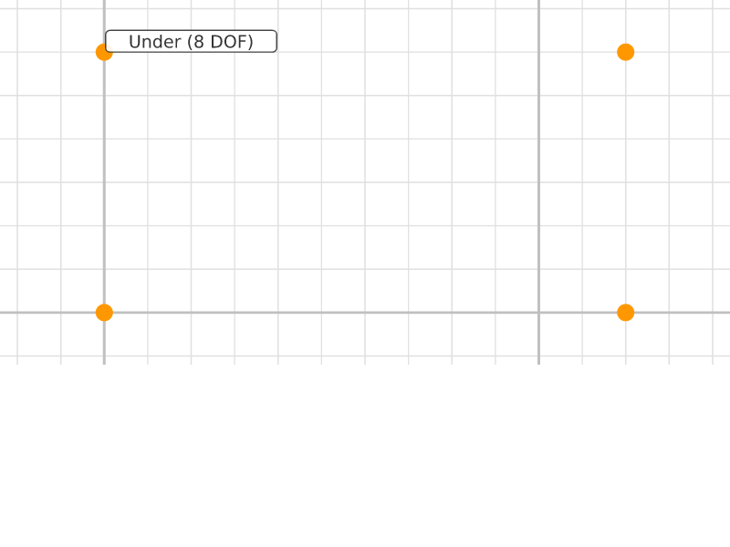
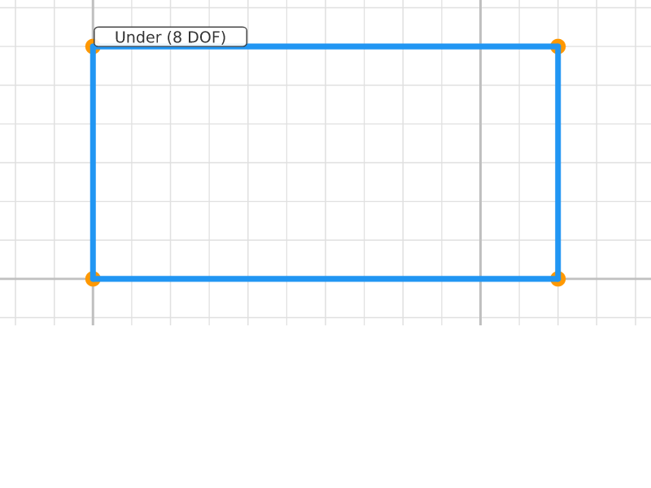
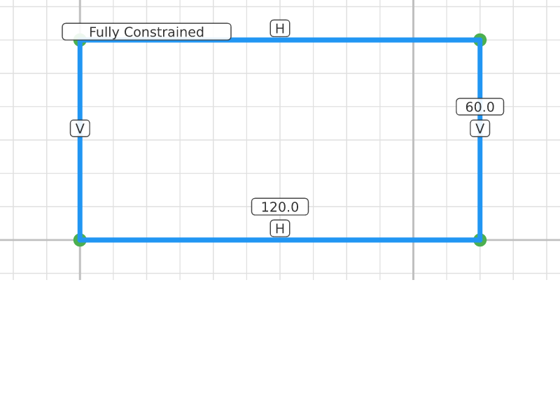
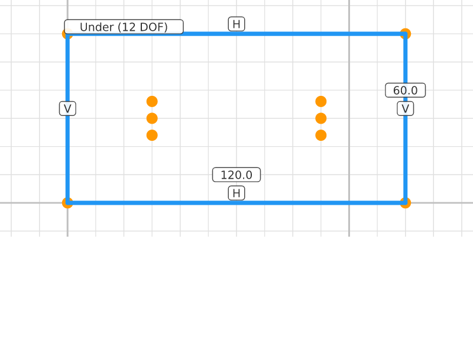
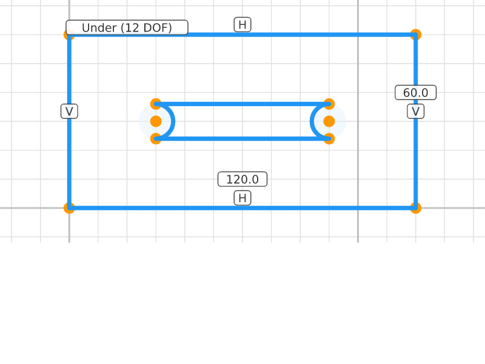
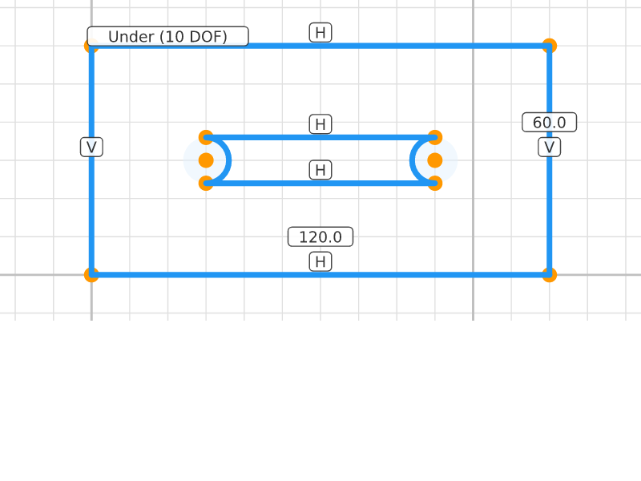
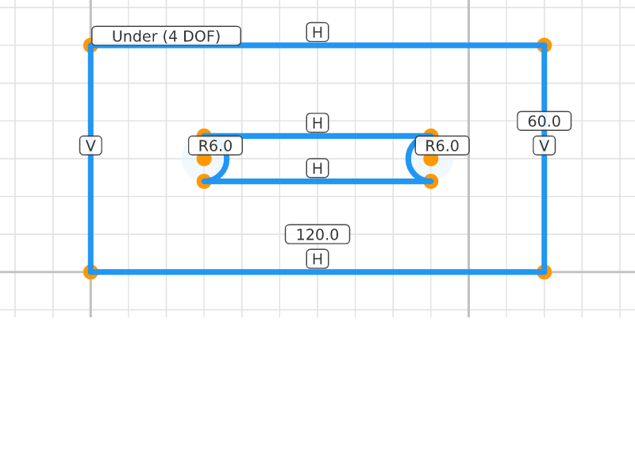
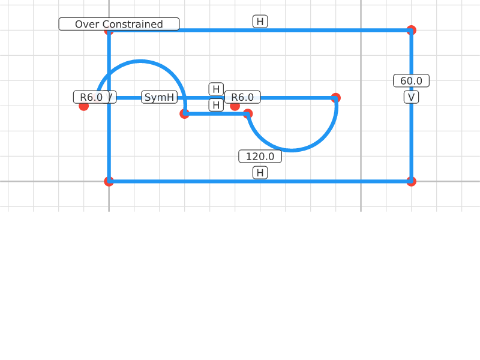

# Slotted Plate

## Step 0: Plate Corners
**Status**: Under-constrained (8 DOF) | **Entities**: 4 pt | **Constraints**: 0
> Four corners of the outer plate rectangle.

| Point | X | Y |
|-------|-------|-------|
| P1 | 0.00 | 0.00 |
| P2 | 120.00 | 0.00 |
| P3 | 120.00 | 60.00 |
| P4 | 0.00 | 60.00 |

---

## Step 1: Plate Outline
**Status**: Under-constrained (8 DOF) | **Entities**: 4 pt, 4 ln | **Constraints**: 0
> Closed rectangular outline for the plate body.

| Point | X | Y |
|-------|-------|-------|
| P1 | 0.00 | 0.00 |
| P2 | 120.00 | 0.00 |
| P3 | 120.00 | 60.00 |
| P4 | 0.00 | 60.00 |

**Profiles detected**: 2 closed profile(s)

---

## Step 2: Plate Constrained
**Status**: Fully constrained (0 DOF) | **Entities**: 4 pt, 4 ln | **Constraints**: 7
> Outer rectangle fully constrained: 120×60mm at origin. Now adding the slot cutout.

**Active constraints**:
- Horizontal(E10)
- Horizontal(E12)
- Vertical(E11)
- Vertical(E13)
- Dragged(P1)
- Distance(E1, E2, 120.0mm)
- Distance(E2, E3, 60.0mm)

| Point | X | Y |
|-------|-------|-------|
| P1 | 0.00 | 0.00 |
| P2 | 120.00 | 0.00 |
| P3 | 120.00 | 60.00 |
| P4 | 0.00 | 60.00 |

**Profiles detected**: 2 closed profile(s)

---

## Step 3: Slot Points
**Status**: Under-constrained (12 DOF) | **Entities**: 10 pt, 4 ln | **Constraints**: 7
> Six points for the slot: left arc (center + endpoints), right arc (center + endpoints). Slot centered at y=30.

**Active constraints**:
- Horizontal(E10)
- Horizontal(E12)
- Vertical(E11)
- Vertical(E13)
- Dragged(P1)
- Distance(E1, E2, 120.0mm)
- Distance(E2, E3, 60.0mm)

| Point | X | Y |
|-------|-------|-------|
| P1 | 0.00 | 0.00 |
| P2 | 120.00 | 0.00 |
| P3 | 120.00 | 60.00 |
| P4 | 0.00 | 60.00 |
| P20 | 30.00 | 24.00 |
| P21 | 30.00 | 36.00 |
| P22 | 30.00 | 30.00 |
| P23 | 90.00 | 24.00 |
| P24 | 90.00 | 36.00 |
| P25 | 90.00 | 30.00 |

**Profiles detected**: 2 closed profile(s)

---

## Step 4: Slot Shape
**Status**: Under-constrained (12 DOF) | **Entities**: 10 pt, 6 ln, 2 arc | **Constraints**: 7
> Slot shape added: two straight sides + two semicircular end caps forming a stadium/slot profile.

**Active constraints**:
- Horizontal(E10)
- Horizontal(E12)
- Vertical(E11)
- Vertical(E13)
- Dragged(P1)
- Distance(E1, E2, 120.0mm)
- Distance(E2, E3, 60.0mm)

| Point | X | Y |
|-------|-------|-------|
| P1 | 0.00 | 0.00 |
| P2 | 120.00 | 0.00 |
| P3 | 120.00 | 60.00 |
| P4 | 0.00 | 60.00 |
| P20 | 30.00 | 24.00 |
| P21 | 30.00 | 36.00 |
| P22 | 30.00 | 30.00 |
| P23 | 90.00 | 24.00 |
| P24 | 90.00 | 36.00 |
| P25 | 90.00 | 30.00 |

**Profiles detected**: 4 closed profile(s)

---

## Step 5: Slot Horizontal
**Status**: Under-constrained (10 DOF) | **Entities**: 10 pt, 6 ln, 2 arc | **Constraints**: 9
> Slot sides constrained horizontal. Slot aligned with plate axis.

**Active constraints**:
- Horizontal(E10)
- Horizontal(E12)
- Vertical(E11)
- Vertical(E13)
- Dragged(P1)
- Distance(E1, E2, 120.0mm)
- Distance(E2, E3, 60.0mm)
- Horizontal(E30)
- Horizontal(E31)

| Point | X | Y |
|-------|-------|-------|
| P1 | 0.00 | 0.00 |
| P2 | 120.00 | 0.00 |
| P3 | 120.00 | 60.00 |
| P4 | 0.00 | 60.00 |
| P20 | 30.00 | 24.00 |
| P21 | 30.00 | 36.00 |
| P22 | 30.00 | 30.00 |
| P23 | 90.00 | 24.00 |
| P24 | 90.00 | 36.00 |
| P25 | 90.00 | 30.00 |

**Profiles detected**: 4 closed profile(s)

---

## Step 6: Slot Constrained
**Status**: Under-constrained (4 DOF) | **Entities**: 10 pt, 6 ln, 2 arc | **Constraints**: 13
> Slot caps R=6mm, centers pinned. Slot is 12mm wide, 60mm long, centered in the plate.

**Active constraints**:
- Horizontal(E10)
- Horizontal(E12)
- Vertical(E11)
- Vertical(E13)
- Dragged(P1)
- Distance(E1, E2, 120.0mm)
- Distance(E2, E3, 60.0mm)
- Horizontal(E30)
- Horizontal(E31)
- Radius(E40, 6.0mm)
- Radius(E41, 6.0mm)
- Dragged(P22)
- Dragged(P25)

| Point | X | Y |
|-------|-------|-------|
| P1 | 0.00 | 0.00 |
| P2 | 120.00 | 0.00 |
| P3 | 120.00 | 60.00 |
| P4 | 0.00 | 60.00 |
| P20 | 30.00 | 24.00 |
| P21 | 30.00 | 36.00 |
| P22 | 30.00 | 30.00 |
| P23 | 90.00 | 24.00 |
| P24 | 90.00 | 36.00 |
| P25 | 90.00 | 30.00 |

**Profiles detected**: 4 closed profile(s)

---

## Step 7: Slot Symmetric
**Status**: Over-constrained (3 conflicts) | **Entities**: 10 pt, 6 ln, 2 arc | **Constraints**: 14
> Slot centers horizontally symmetric. Complete slotted plate with compound profile.

**Active constraints**:
- Horizontal(E10)
- Horizontal(E12)
- Vertical(E11)
- Vertical(E13)
- Dragged(P1)
- Distance(E1, E2, 120.0mm)
- Distance(E2, E3, 60.0mm)
- Horizontal(E30)
- Horizontal(E31)
- Radius(E40, 6.0mm)
- Radius(E41, 6.0mm)
- Dragged(P22)
- Dragged(P25)
- SymmetricH(P22, P25)

| Point | X | Y |
|-------|-------|-------|
| P1 | 0.00 | 0.00 |
| P2 | 120.00 | 0.00 |
| P3 | 120.00 | 60.00 |
| P4 | 0.00 | 60.00 |
| P20 | 30.00 | 26.85 |
| P21 | -4.89 | 33.15 |
| P22 | -10.00 | 30.00 |
| P23 | 55.11 | 26.85 |
| P24 | 90.00 | 33.15 |
| P25 | 50.00 | 30.00 |

---
